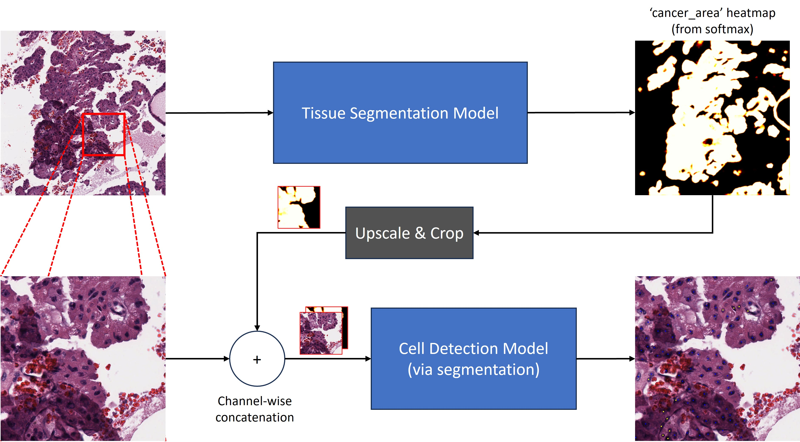

# OCELOT Cell Detection Leveraging Tissue Segmentation
This repository contains code that can be used to train and evaluate models that were submitted for the [OCELOT Grand Challenge](https://ocelot2023.grand-challenge.org/ocelot2023/)

This also includes files provided by the [OCELOT Grand Challenge](https://github.com/lunit-io/ocelot23algo) for:
* Testing, Building, and Exporting the Docker image
* Running evaluation on generated predictions
* Running the inference tool on image data

The structure of this repository generally follows the structure provided by the [OCELOT Grand Challenge](https://github.com/lunit-io/ocelot23algo).

The training and inference parts of the repository are configured to match what was used in the OCELOT Grand Challenge.

## Local Installation
A Dockerfile is provided for use with this repository. Follow the below steps if you'd like to install locally:
1. `conda env create -f environment.yml`
2. `conda env activate ocelot`

*Note:* Installation via [mamba](https://github.com/mamba-org/mamba) instead of conda is suggested for parallel downloads and faster dependency solving.

### Windows Installation
If installing on a Windows machine, replace the `pytorch` dependency in the `environment.yml` file with the following:  
`pytorch::pytorch=1.11.0=py3.9_cuda11.5_cudnn8_0`
  

## Running Evaluation on Generated Predictions
Below are instructions on running evaluation on predictions generated by the `process.py` script: 

1. Follow the instructions in `evaluation/README.md` to convert annotation CSV files to format required by evaluation code
2. Create a directory that contains the images you want to evaluate on (in the same structure as the existing test images).
   1. Make a copy of the metadata file, and leave in the images you're evaluating over. NOTE: See the sample metadata format. Ordering is based on indexing into the list.
   2. It's very important you get the ordering right. On the image loading side, it's based on ordering of the filenames. In the metadata file, it's based on how you order the list.
   3. It's not ideal, but it's based on how it was already implemented. Also based on how the convert_gt_csvs_to_json script works
3. Modify `util/constants.py` so the filepaths point to your images.
4. Place your model weights in `user/weights`. You can follow the instructions in `user/weights/README.md` to download the set of pretrained weights used for the OCELOT Grand Challenge submission.
5. Run `python process.py`
6. Move the generated predictions to the expected location in `evaluation/eval.py`
7. Run `python evaluation/eval.py`

## Training Models
Below are instructions on the steps to take to train your own models.

1. Preprocess the OCELOT data with the preprocess script:
   * `python preprocess_ocelot_dataset.py --ocelot-directory /path/to/ocelot --output-directory /path/to/processed/directory`
   * This script has the option `--extract-overlays` to also generate JPG files showing the annotations overlaid on the image data.
2. Train the tissue segmentation model:
   * `python train_tissue_model.py --data-directory /path/to/processed/directory --output-directory /path/to/tissue/outputs`
   * A number of parameters can be configured as command line arguments. Defaults match the settings used to train the model for submission to the OCELOT Grand Challenge.
   * The default split file used is the one that contains an internal training and validation set. The `split-directory` argument can be used to swap to the `all_train` split.
   * This will output to the directory the following files:
     * `model-latest.pth`: The weights from the trained model (at the latest epoch).
     * `train_log.csv`: Information related to model training (loss & metrics).
     * `val_log.csv`: Information related to model evaluation (loss & metrics) ONLY if the validation split exists.
3. Run the tissue segmentation on the cell images (to generate softmaxed input for use with the cell detection model):
   * `python generate_tissue_segmentation_masks.py --ocelot-directory /path/to/ocelot --data-directory /path/to/processed/directory --weights-path /path/to/tissue/outputs/model-latest.pth --output-directory /path/to/tissue/cell_inference`  
   * This script also has an `--extract-overlays` option to generate JPG files illustrating model predictions. This will output 2x sets of images:
     * The tissue image scaled and cropped to the cell image, with the **ARGMAXED** predictions overlaid. Red = Cancer Area, Blue = Background Area, Black = Unknown
     * An RGB representation of the Cancer Area heatmap. Whiter (hotter) areas = higher confidence, darker areas = lower confidence
4. Train the cell detection model:
   * `python train_tissue_model.py --data-directory /path/to/processed/directory --cancer-area-heatmap-directory /path/to/tissue/cell_inference --output-directory /path/to/tissue/outputs`
   * A number of parameters can be configured as command line arguments. Defaults match the settings used to train the model for submission to the OCELOT Grand Challenge.
   * The default split file used is the one that contains an internal training and validation set. The `split-directory` argument can be used to swap to the `all_train` split.
   * This will output to the directory the following files:
     * `model-latest.pth`: The weights from the trained model (at the latest epoch).
     * `train_log.csv`: Information related to model training (loss & metrics).
     * `val_log.csv`: Information related to model evaluation (loss & metrics) ONLY if the validation split exists.

Once the tissue and cell detection models are trained, you can then follow the instructions in [Running Evaluation on Generated Predictions](#running-evaluation-on-generated-predictions) to use these models to run inference on the Grand Challenge data.
